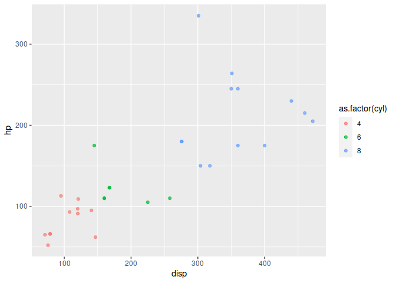
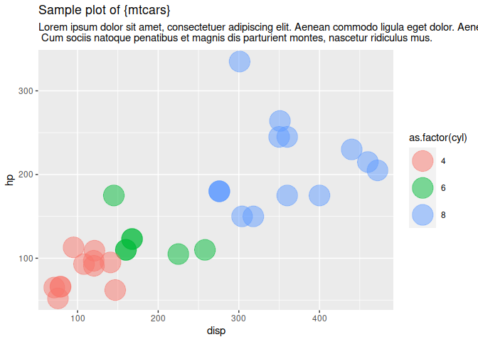
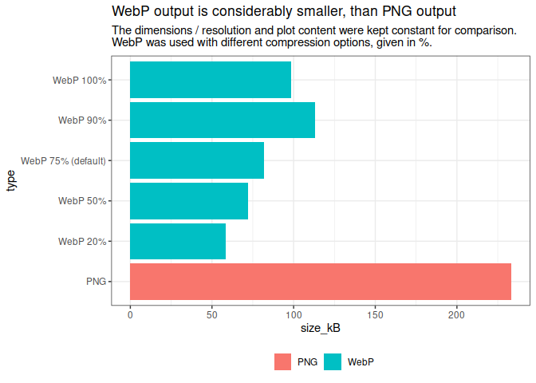
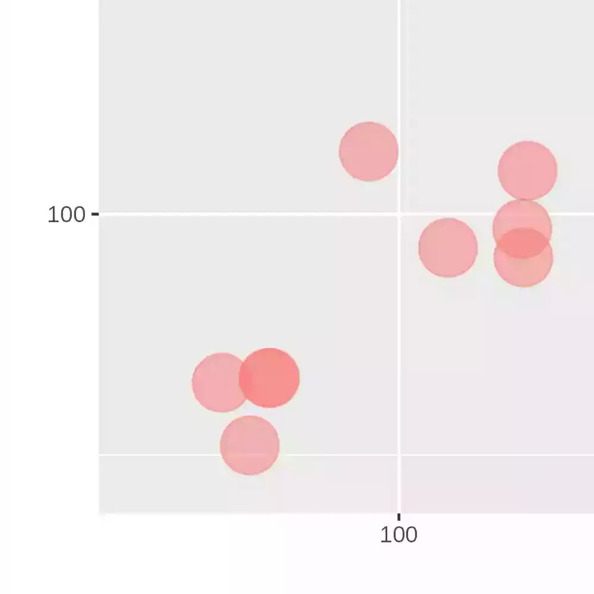
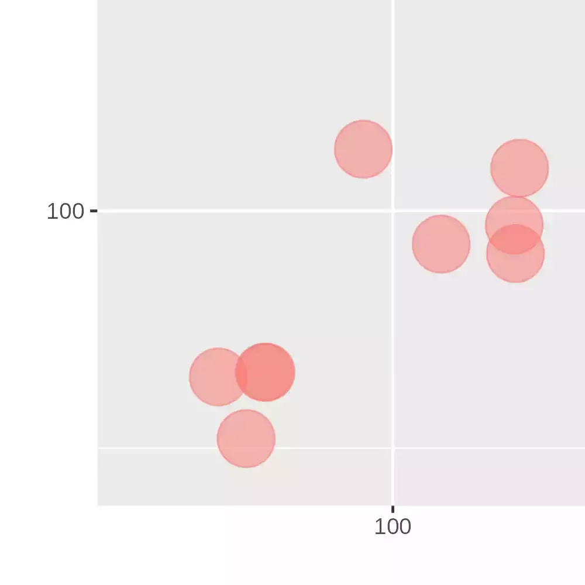
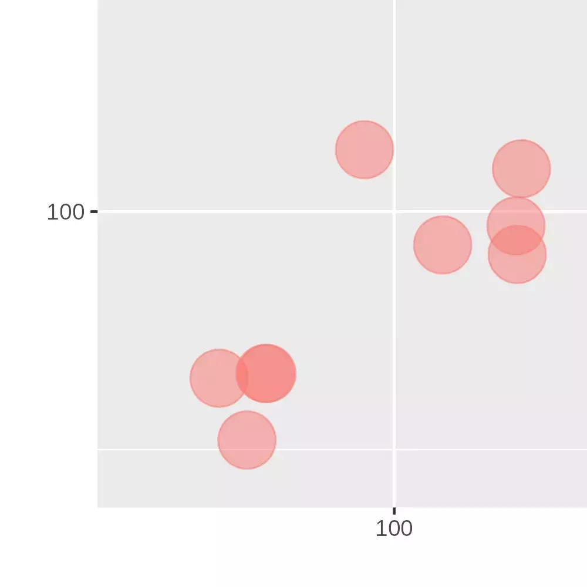
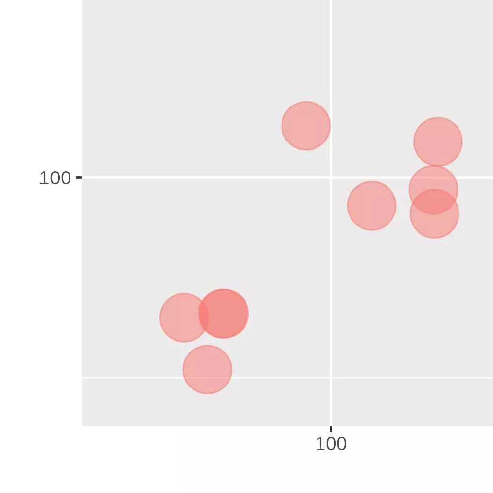
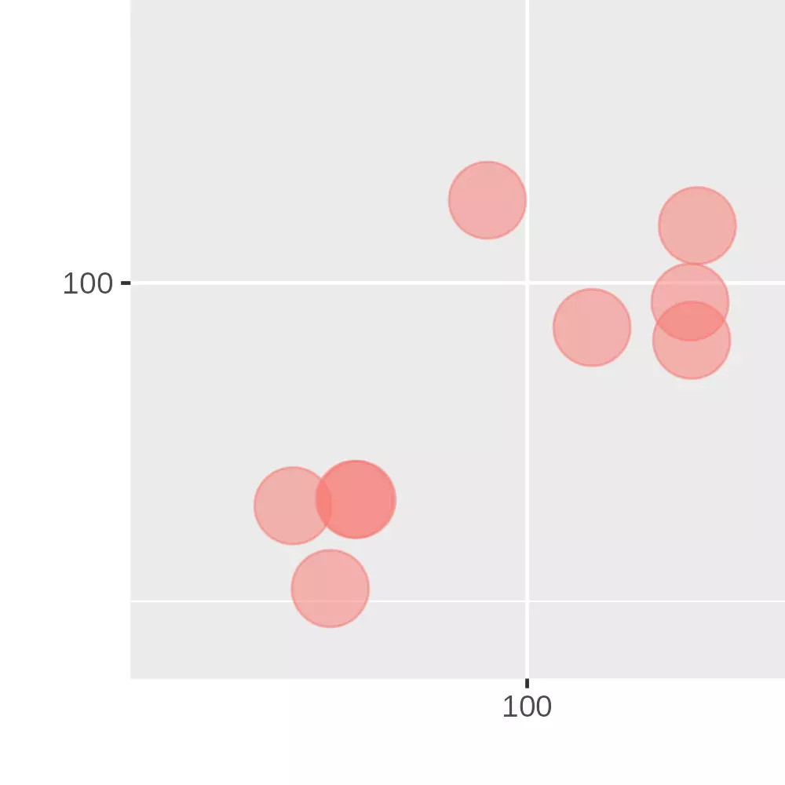

<!-- README.md is generated from README.Rmd. Please edit that file -->

# webpea 

<!-- badges: start -->

[](https://github.com/nucleic-acid/webpea/actions/workflows/R-CMD-check.yaml)
<!-- badges: end -->

The goal of `{webpea}` is to provide easy functions to save a plot in
the [WebP image file format](https://en.wikipedia.org/wiki/WebP). There
are other packages with the same purpose, such as `{webp}`. In
particular, `{webpea}` aims to be a drop-in replacement for
`ggplot2::ggsave()` or to allow easy implementation in Rmarkdown and
Quarto documents.

## Installation

You can install the development version of webpea from
[GitHub](https://github.com/) with:

``` r
# install.packages("remotes")
remotes::install_github("nucleic-acid/webpea")
```

## Drop-in replacement of ggsave

`webpea::webpea()` can serve as drop-in replacement of
`ggplot2::ggsave()`. First, the plot is saved as a temporary PNG file,
so all `ggplot2::ggsave()` parameters can be used as usual. Secondly the
temporary PNG file is converted to WebP via the {magick} package.

If no plot is specified, `ggplot2::ggsave()` defaults to
`ggplot2::last_plot()`.:

``` r
library(webpea)

# draw basic plot
ggplot2::ggplot(mtcars) +
  ggplot2::aes(disp, hp, color = as.factor(cyl)) +
  ggplot2::geom_point(alpha = 0.7)
```



``` r

# save last plot to temporary file location
webpea(tempfile("plot", fileext = ".webp"))
#> [1] "/tmp/Rtmp9zX7MA/plot470452448b148.webp"
```

All parameters for `ggplot2::ggsave()` are valid and can be specified in
`webpea()`. You can also explicitly specify the plot to be saved.
Additionally, you can specify the quality as percentage (defaults to 75
in the {magick} package, if not specified otherwise):

``` r
library(webpea)

# draw first plot
p1 <- ggplot2::ggplot(mtcars) +
  ggplot2::aes(disp, hp, color = cyl) +
  ggplot2::geom_point(alpha = 0.7)

# draw another plot
p2 <- ggplot2::ggplot(mtcars) +
  ggplot2::aes(disp, hp, color = gear) +
  ggplot2::geom_point(alpha = 0.5, size = 3)

# save first plot to temporary file location
webpea(
  tempfile("plot1_", fileext = ".webp"),
  plot = p1,
  width = 16,
  height = 9,
  quality = 90
)
#> [1] "/tmp/Rtmp9zX7MA/plot1_4704525d2351e.webp"
```

## Using {magick}’s graphics device

In case you want to prevent double file writing (i.e. intermediate PNG
and the final WebP), you can draw the plot into {magick}’s graphics
device in memory and save that image as WebP. **Note:** Since ggsave is
not used in this approach, you cannot use its arguments for
output-settings!

All options that can be passed to the graphics device are valid in
`webpea()` as well. The options / defaults can be found in [the
documentation of
`magick::image_graph()`](https://docs.ropensci.org/magick/reference/device.html).

``` r
library(webpea)

# draw basic plot
p_draw <- ggplot2::ggplot(mtcars) +
  ggplot2::aes(disp, hp, color = as.factor(cyl)) +
  ggplot2::geom_point(alpha = 0.7)

# save last plot to temporary file location
webpea(
  tempfile("plot", fileext = ".webp"),
  plot = p_draw,
  ggsave = FALSE, # this switches to the {magick} graphics device
  width = 1920,
  height = 1080,
  res = 326,
  quality = 42
  )
#> [1] "/tmp/Rtmp9zX7MA/plot47045991db42.webp"
```

## When size matters

The WebP image file format uses rather modern and effective compression
algorithmy and allows for significant file size reduction when compared
to PNG files. These reductions come with no visually apparent losses in
the quality of the produced output in most use cases.

In times of digital communication of R outputs (e.g. HTML-output of
Rmarkdown or Quarto) image file size is crucial for quick file transfer
or reduced page loading times.

``` r
library(webpea)

# draw a plot
ggplot2::ggplot(mtcars) +
  ggplot2::aes(disp, hp, color = as.factor(cyl)) +
  ggplot2::geom_point(
    alpha = 0.5,
    size = 10
  ) +
  ggplot2::labs(
    title = "Sample plot of {mtcars}",
    subtitle = "Lorem ipsum dolor sit amet, consectetuer adipiscing elit. Aenean commodo ligula eget dolor. Aenean massa.\n Cum sociis natoque penatibus et magnis dis parturient montes, nascetur ridiculus mus."
  )
```



``` r

# save plot as PNG

ggplot2::ggsave(
  tempfile("plot_", fileext = ".png"),
  width = 16,
  height = 9,
  device = "png",
  dpi = "retina"
)
#> file size 233.2 kB
```

This saves a PNG file with 5.120 \* 2.880 pixels (14.7 MP) and 233.2 kB
file size. When using WebP as output type, the images below have the
same resolution in pixels, but significantly lower file sizes:

``` r
# save plot with same settings for intermediate PNG and DEFAULT webp quality (75)
webpea(
  tempfile("plot_", fileext = ".webp"),
  width = 16,
  height = 9,
  device = "png", # this is passed to ggsave. The final output will still be webp.
  dpi = "retina"
)
#> [1] "/tmp/Rtmp9zX7MA/plot_470454fa2e9cf.webp"
#> file size 81.7 kB


# save plot with same PNG settings but LOWER webp quality
webpea(
  tempfile("plot50_", fileext = ".webp"),
  width = 16,
  height = 9,
  device = "png", # this is passed to ggsave. The final output will still be webp.
  dpi = "retina",
  quality = 50
)
#> [1] "/tmp/Rtmp9zX7MA/plot50_4704548feac7.webp"
#> file size 72.3 kB

# save plot with same PNG settings but EVEN LOWER webp quality
webpea(
  tempfile("plot20_", fileext = ".webp"),
  width = 16,
  height = 9,
  device = "png", # this is passed to ggsave. The final output will still be webp.
  dpi = "retina",
  quality = 20
)
#> [1] "/tmp/Rtmp9zX7MA/plot20_4704531c6fcfc.webp"
#> file size 58.2 kB

# save plot with same PNG settings but HIGHER webp quality
webpea(
  tempfile("plot90_", fileext = ".webp"),
  width = 16,
  height = 9,
  device = "png", # this is passed to ggsave. The final output will still be webp.
  dpi = "retina",
  quality = 90
)
#> [1] "/tmp/Rtmp9zX7MA/plot90_4704537b9cd60.webp"
#> file size 113.0 kB

# save plot with same PNG settings but HIGHEST webp quality
webpea(
  tempfile("plot100_", fileext = ".webp"),
  width = 16,
  height = 9,
  device = "png", # this is passed to ggsave. The final output will still be webp.
  dpi = "retina",
  quality = 100
)
#> [1] "/tmp/Rtmp9zX7MA/plot100_470456793a789.webp"
#> file size 98.6 kB
```

Oddly, the 100% quality version has a smaller file size than the 90%
version. I don’t have an explanation for this, but the main takeaway is
that, all WebP files are smaller than the original PNG. These results
are just exemplatory, your milage may vary! Eventually, the ‘allowable’
loss of quality is to be defined by every user for themselves and for
their specific use case.

``` r
sizes <- data.frame(
  type = factor(
    c("PNG", "WebP 20%", "WebP 50%", "WebP 75% (default)", "WebP 90%", "WebP 100%"),
    levels = c("PNG", "WebP 20%", "WebP 50%", "WebP 75% (default)", "WebP 90%", "WebP 100%")
  ),
  size_kB = c(233.2, 58.2, 72.3, 81.7, 113.0, 98.6),
  cat = c("PNG", "WebP", "WebP", "WebP", "WebP", "WebP")
)

ggplot2::ggplot(sizes) +
  ggplot2::aes(
    x = type,
    y = size_kB,
    fill = cat
  ) +
  ggplot2::geom_col() +
  ggplot2::labs(
    title = "WebP output is considerably smaller, than PNG output",
    subtitle = "The dimensions / resolution and plot content were kept constant for comparison. \nWebP was used with different compression options, given in %."
  ) +
  ggplot2::coord_flip() +
  ggplot2::theme_bw() +
  ggplot2::theme(
    legend.position = "bottom",
    legend.title = ggplot2::element_blank()
  )
```



| PNG original                                                                                                                                                   | WebP with 20, 50, 75, 90 and 100% quality                                                                                                                                           |
|----------------------------------------------------------------------------------------------------------------------------------------------------------------|-------------------------------------------------------------------------------------------------------------------------------------------------------------------------------------|
|  |   |
|  |   |
|  |   |
|  |   |
|  |  |

## How to contribute

If you have ideas for improvements or new features feel free to fork and
make pull requests to the dev branch. I’m always open to contributions!

## Code of Conduct

Please note that the webpea project is released with a Contributor Code
of Conduct. By contributing to this project, you agree to abide by its
terms.
